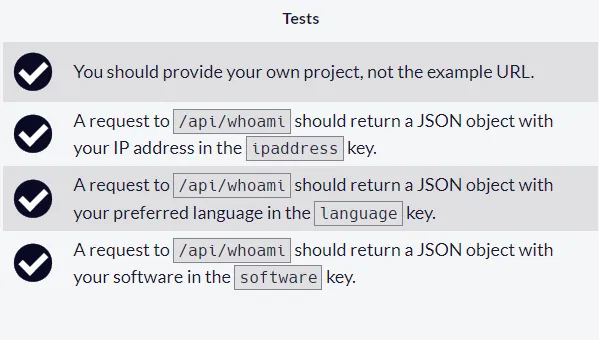
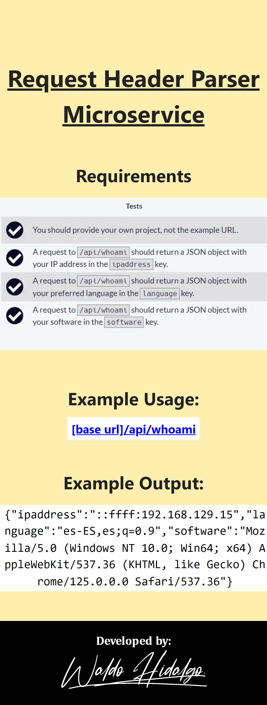
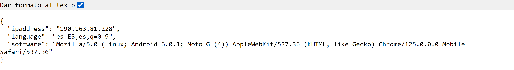

# Request Header Parser Microservice

Segundo proyecto requisito obligatorio para obtener la [Back End Development and APIs Certification](https://www.freecodecamp.org/learn/apis-and-microservices/apis-and-microservices-projects/request-header-parser-microservice)

## Requisitos

## Screenshots

### 1. Home

### 2. API

